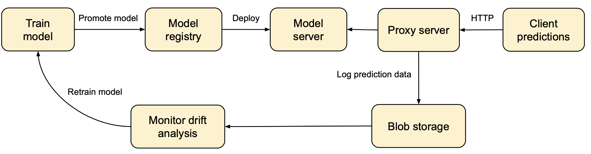
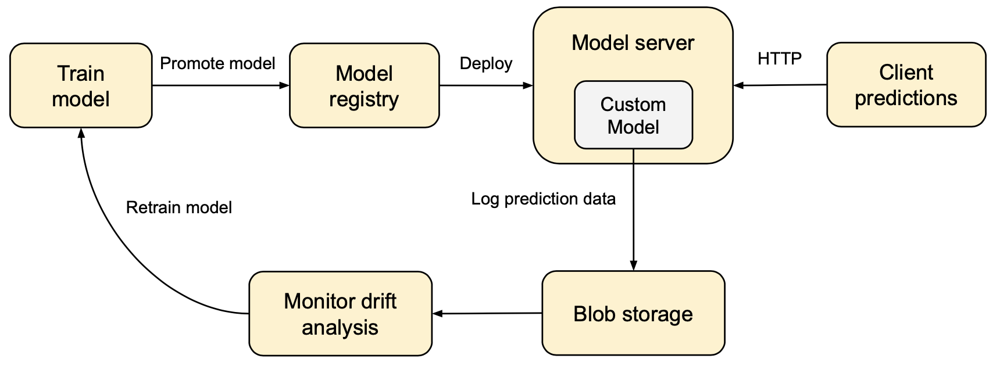

# MLflow model monitoring example

A simple example demonstrating how to log request and response (prediction) data for an MLflow model server.
Once the data is logged, a separate process can monitor the logging location and do analytics to determine data drift 
and then launch model retraining and redeployment.

Two ways to log:
* With proxy server that logs the data. Only `split-orient` JSON input is currently supported.
* With custom [PythonModel](https://www.mlflow.org/docs/latest/models.html#custom-python-models) that logs the data.

The data is currently logged to local disk. Next TODO is to log it to cloud storage (S3).

## Setup

```
conda env create --file conda.yaml
conda activate mlflow-model-monitoring
```
## Train and register two models

```
python custom_model_train.py
```

This will create two registered models: `sklearn-monitor` and `sklearn-monitor-custom`.

## Proxy Server

The proxy server forwards the request to the actual model server, and then logs the input and output data as a CSV file.



Source code: [proxy_server.py](proxy_server.py).

Start model server.
```
mlflow models serve --port 5002 --model-uri models:/sklearn-monitor/production
```

Start proxy server.
```
python proxy_server.py --port 5001 --mlflow-model-server-uri http://localhost:5002/invocations --log_dir out
```

## Custom PythonModel 



Source code: [custom_model_train.py](custom_model_train.py).

Start model server.
```
export MLFLOW_MONITORING_DIR=tmp
mlflow models serve --port 5001 --model-uri models:/sklearn-monitor-custom/production
```

## Predictions

```
curl -X POST \
  -H "accept: application/json" \
  -H "Content-Type:application/json" \
  -d '{ "columns": [ "alcohol", "chlorides", "citric acid", "density", "fixed acidity",
                     "free sulfur dioxide", "pH", "residual sugar", "sulphates",
                     "total sulfur dioxide", "volatile acidity" ],
        "data": [
          [ 7,   0.27, 0.36, 20.7, 0.045, 45, 170, 1.001,  3,    0.45,  8.8 ],
          [ 6.3, 0.3,  0.34,  1.6, 0.049, 14, 132, 0.994,  3.3,  0.49,  9.5 ] ] }' \
  http://localhost:5001/invocations
```

## Logging directory

Each request for scoring will generate a CSV file containing the input data and the prediction. 
The following example shows data for three requests.

```
ls -l out

74b9c823-fd32-493e-8cdd-45834369c506.csv
8d55b5e6-7693-49c0-8f69-2cc2ae0b2f6b.csv
e0d90bb3-b528-43ef-82d9-2ca14fcac266.csv
```

```
cat 74b9c823-fd32-493e-8cdd-45834369c506.csv

prediction,fixed acidity,volatile acidity,citric acid,residual sugar,chlorides,free sulfur dioxide,total sulfur dioxide,density,pH,sulphates,alcohol
6.0,7,0.27,0.36,20.7,0.045,45,170,1.001,3,0.45,8.8
6.0,6.3,0.3,0.34,1.6,0.049,14,132,0.994,3.3,0.49,9.5
5.0,8.1,0.28,0.4,6.9,0.05,30,97,0.9951,3.26,0.44,10.1
```

